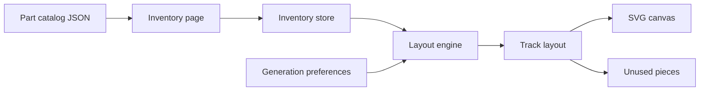

# Architecture

This document is the proposed shape of the application. The boilerplate only contains the shell and home page today.

## Principles

- Keep generation logic out of Angular components.
- Treat the track catalog as data, not hardcoded UI.
- Persist inventory in `localStorage` first.
- Render the layout as SVG so designs stay sharp when zooming and printing.

## Feature modules

```text
src/app/
  core/
    catalog/           Load and expose the part catalog
    inventory/         Read/write owned quantities
    layout-engine/     Pure TypeScript search and scoring
    storage/           localStorage adapter
  features/
    home/              Landing page (exists)
    inventory/         Catalog + quantity editor
    designer/          Generate, inspect, regenerate
  shared/
    models/            TrackPart, Inventory, Layout types
    ui/                Quantity stepper, part card, empty states
    canvas/            SVG track renderer
```

Angular feature folders stay thin. They bind UI to services. The layout engine should be importable as plain TypeScript so it can be unit-tested without TestBed.

## Data flow



1. Catalog JSON defines legal parts and geometry.
2. The inventory store holds owned quantities.
3. The designer page sends inventory + preferences into the engine.
4. The engine returns a layout or a clear failure reason.
5. The canvas draws placed parts and connections.

## Layout engine

Recommended first algorithm: **guided backtracking**.

1. Place a seed piece at the origin.
2. Maintain a list of open ports.
3. For each open port, try inventory parts that can legally connect.
4. Reject placements that collide or leave the canvas bounds.
5. Prefer moves that close a nearby open port.
6. Stop when the goal is met (closed loop, piece budget, or timeout).
7. Keep the best N layouts by score.

Why this first:

- The City catalog is small, so exhaustive search with pruning is realistic.
- Constraints are geometric and discrete, which fits backtracking.
- Failures are explainable: "no legal connection for the remaining curve".

Later options if quality stalls:

- Beam search for larger inventories
- Simulated annealing for compact rearrangements
- A worker thread so the UI stays responsive

Do not start with a physics engine or a generic pathfinder. Tracks are rigid pieces with fixed connectors.

## Rendering

Use SVG groups per placed part:

- Simple top-down silhouettes first (straight bar, arc, Y-switch, plus crossing)
- Grid and scale bar so the builder can judge table size
- Color-code part types
- Highlight unused connectors

Canvas 2D is a fallback only if SVG performance becomes an issue with very large layouts.

## State

Use Angular signals in feature stores:

- `catalog`
- `inventory`
- `preferences`
- `currentLayout`
- `generationStatus`

No NgRx in the first version. Add it only if several features start writing the same state.

## Persistence

```ts
localStorage key: lego-track-designer.inventory.v1
```

Export/import as JSON can follow quickly because the same payload is already serializable.

## Testing

| Layer | What to test |
| --- | --- |
| Domain types | Catalog schema validation |
| Engine | Connector matching, collision, inventory limits, a known 16-curve circle |
| Inventory store | Quantity updates and persistence |
| Canvas | Renders a fixture layout without throwing |

The 16-curve circle is the first golden test. If that fails, the geometry model is wrong.

## Folder ownership

| Concern | Owner |
| --- | --- |
| Official part list and measurements | `src/assets/catalog/` |
| Search algorithm | `src/app/core/layout-engine/` |
| Visual language | `src/styles.scss` and `shared/canvas/` |
| User-facing copy | feature templates and `docs/PRODUCT.md` |
